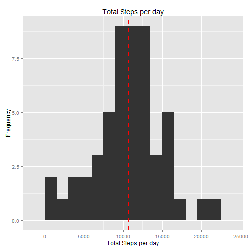
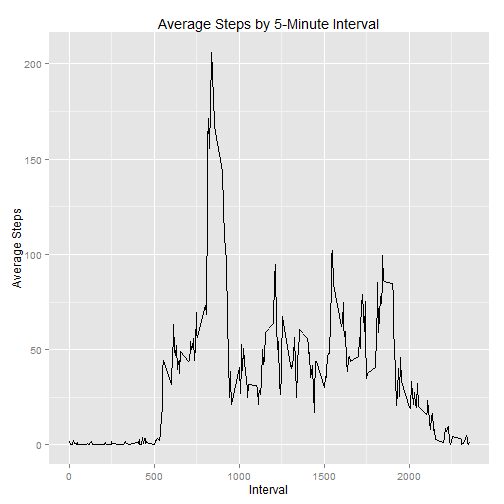
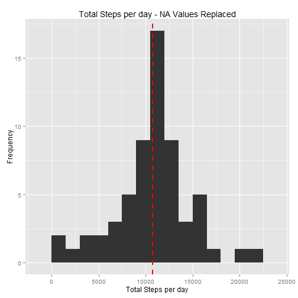
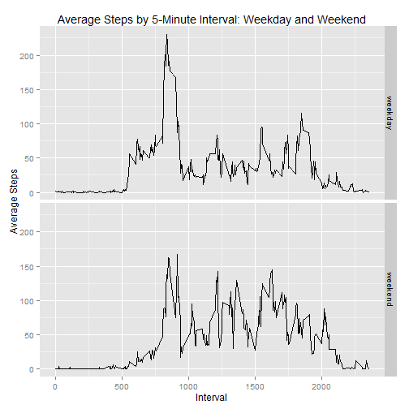

# Introduction

Activity monitoring devices such as FitBit allows the collection of data about personal movement, namely the number of steps taken over 5-minutes intervals. Based on this data, a person's activity can be analyzed to discern patters and draw conclusions. This report analyzes the data of one person over a two-week period.

# Loading and preprocessing the data

The data set was sourced from the following: https://d396qusza40orc.cloudfront.net/repdata%2Fdata%2Factivity.zip 

The file was downloaded to a working directory and then loaded into R. The date column was converted into a date class.


```r
setwd("~/Dave/Coursera/DataScientistsToolKit/RepData_PeerAssessment1")
activity_data <- read.csv (unz("activity.zip","activity.csv"))
activity_data$date <- as.Date(as.character(activity_data$date), "%Y-%m-%d")
```

# Methods

The methods used were summarizing the original data by date and interval and creating charts and tables. Then missing values were imputed and the data summarized again by interval and charts and tables were created. Finally, the data were summarized interval and then analyzed accross weekday or weekend. 

The following libraries were used:

```r
library(plyr)
library(ggplot2)
```

# Results

## 1. What is mean total number of steps taken per day?

The original data is summarized by date. The following calcuates the total, median and mean number of steps per day.


```r
summary_by_date <- ddply (activity_data, .(date), summarize, totalsteps=sum(steps), mediansteps=median(steps),meansteps=mean(steps))
```

The following histogram show the total number of steps taken each day. The median is shown as a red line.


```r
g <- ggplot (summary_by_date, aes(totalsteps))
g + geom_histogram(binwidth=1500) + labs(x="Total Steps per day", y="Frequency", title="Total Steps per day") + geom_vline(aes(xintercept=median(totalsteps, na.rm=TRUE)), color="red", linetype="dashed", size=1)
```

 

The following shows the calculation of the mean and median of the total number of steps taken per day. 


```r
steps.mean   <- as.character(trunc(mean(summary_by_date$totalsteps, na.rm=TRUE)))
steps.median <- median(summary_by_date$totalsteps, na.rm=TRUE)
```

The mean number of steps is 10766 and the median number of steps is 10765. 

## 2. What is the average daily activity pattern?

To determine the average daily activity pattern, the data is summarized by interval

```r
summary_by_interval <- ddply ( activity_data, .(interval), summarize, meansteps = mean(steps,na.rm=TRUE))
```

The following time-series shows the average steps taken over the two week by each 5-minute interval. 

```r
g <- ggplot (summary_by_interval, aes(x=interval,y=meansteps))
g + geom_line() + labs(x="Interval", y="Average Steps", title="Average Steps by 5-Minute Interval")
```

 

The 5-minute interval that contains the maximum number of steps is listed below:

```r
summary_by_interval[which.max(summary_by_interval$meansteps),]
```

```
##     interval meansteps
## 104      835  206.1698
```

## 3. Imputing missing values

Missing values in the dataset might introduce bias into the calculations or summaries of the data. This question will explore the impact of missing values. 

The table below show the missing values from the orignal dataset.


```r
sapply(activity_data, function(x) sum(is.na(x)))
```

```
##    steps     date interval 
##     2304        0        0
```

For this analysis, the missing values are filled in with the mean number of steps accross all days for the 5-minute interval. The following code first copies the original data set, creates a new dataset with the imputed values and then summarizes the imputed data set by date. 


```r
activity_data_imputed <- activity_data

activity_data_imputed$steps <- mapply(function(steps, interval) if (is.na(steps)) {summary_by_interval[summary_by_interval$interval==interval,"meansteps"]} else {steps}, activity_data_imputed$steps, activity_data_imputed$interval )

summary_by_date_imputed <- ddply (activity_data_imputed, .(date), summarize, totalsteps=sum(steps), mediansteps=median(steps),meansteps=mean(steps))
```

The following histogram shows the total number of steps taken each day based on the inputed values. The median value is in red.


```r
g2 <- ggplot (summary_by_date_imputed, aes(totalsteps))
g2 + geom_histogram(binwidth=1500) + labs(x="Total Steps per day", y="Frequency", title="Total Steps per day - NA Values Replaced") + geom_vline(aes(xintercept=median(totalsteps, na.rm=TRUE)), color="red", linetype="dashed", size=1) 
```

 

The graph more closely follows a normal distribution. 

The following shows the calculation for mean and median total number of steps taken per day for the imputed dataset.


```r
steps_i.mean   <- as.character(trunc(mean(summary_by_date_imputed$totalsteps, na.rm=TRUE)))
steps_i.median <- as.character(trunc(median(summary_by_date_imputed$totalsteps, na.rm=TRUE)))
```

For the dataset with the imputted missing values, the mean number of steps is 10766 and the median number of steps is 10766. The original data set mean was 10766 and the median was 10765. The values are the same so using the mean for the time-interval had no effect on the meadian and meann.

## 4. Are there differences in activity patterns between weekdays and weekends?

The following code creates a factor variable of either "weekday" or "weekend" and adds it to the imputed dataset. It then summarizes the data by the 5-minute interval and the factor variable. 

```r
activity_data_imputed$weekdayend <- factor(ifelse(weekdays(activity_data_imputed$date,abbreviate=TRUE) == "Sat" | weekdays(activity_data_imputed$date,abbreviate=TRUE) == "Sun", "weekend","weekday"))

summary_by_interval_weekdayend <- ddply (activity_data_imputed, .(interval,weekdayend), summarize, totalsteps=sum(steps), mediansteps=median(steps),meansteps=mean(steps))
```

The following panel plot shows the average number of steps taken during each 5-minute interval for the weekdays and weekends. 


```r
g <- ggplot (summary_by_interval_weekdayend, aes(x=interval,y=meansteps))
g + geom_line() + facet_grid(weekdayend ~ .) + labs(x="Interval", y="Average Steps", title="Average Steps by 5-Minute Interval: Weekday and Weekend")
```

 

# Conclusions
This report summarized activity data across multiple dimensions, analyzed and reported the findings. 
